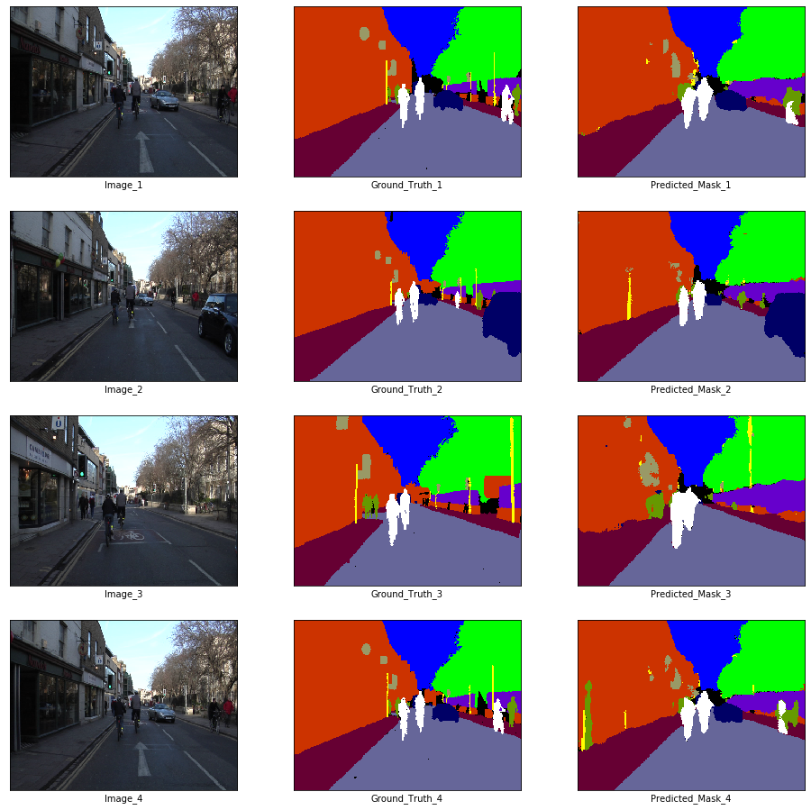

# Enet

Pytorch Implementation of ENet: A Deep Neural Network Architecture for Real-Time Semantic Segmentation (https://arxiv.org/abs/1606.02147). It is currently the 13th Best Model for [Real-Time Semantic Segmentation on Cityscapes test     ](https://paperswithcode.com/sota/real-time-semantic-segmentation-on-cityscapes).

### Training Notebooks

**Note:** Try using the Binder badge to inspect the notebooks.

- [Enet with PReLU Encoder on CamVid](https://github.com/soumik12345/Enet/blob/master/Enet_CamVid.ipynb)
- [Enet with Mish Encoder on CamVid](https://github.com/soumik12345/Enet/blob/master/Enet_CamVid_Mish.ipynb)

## Training Results on [CamVid Dataset](https://www.kaggle.com/jcoral02/camvid)

### Inference on Training Data

### Inference on Validation Data

## TODO

- [x] Implement Vanilla Enet Architecture
- [x] Encorporate Custom Activations for Codebase
- [x] Train Enet on CamVid
- [x] Train Enet with Mish Encoder on CamVid
- [x] Experiment to find best Mish Version of Enet -> PReLU encoder + Mish Decoder
- [ ] Repeat Same experiments for Cityscapes Dataset
- [ ] Repeat Same experiments for SUN RGB-D Dataset
- [ ] Implement Lovasz Softmax Loss

## References

- [ENet: A Deep Neural Network Architecture for Real-Time Semantic Segmentation](https://arxiv.org/abs/1606.02147)
- [Tensorflow Enet](https://github.com/kwotsin/TensorFlow-ENet)
- [ENet on TowardsDataScience](https://towardsdatascience.com/enet-a-deep-neural-architecture-for-real-time-semantic-segmentation-2baa59cf97e9)
- [Mish: Self Regularized Non-Monotonic Activation Function](https://github.com/digantamisra98/Mish)
- [Mish on Arxiv](https://arxiv.org/abs/1908.08681)
